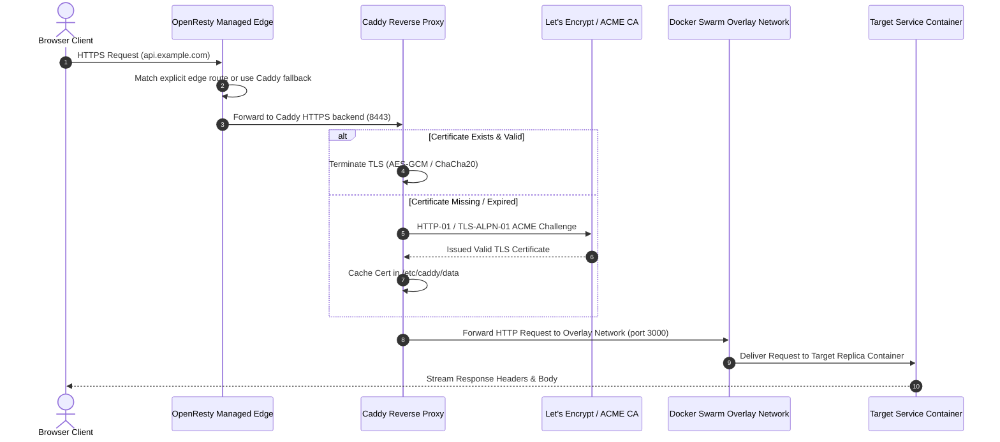
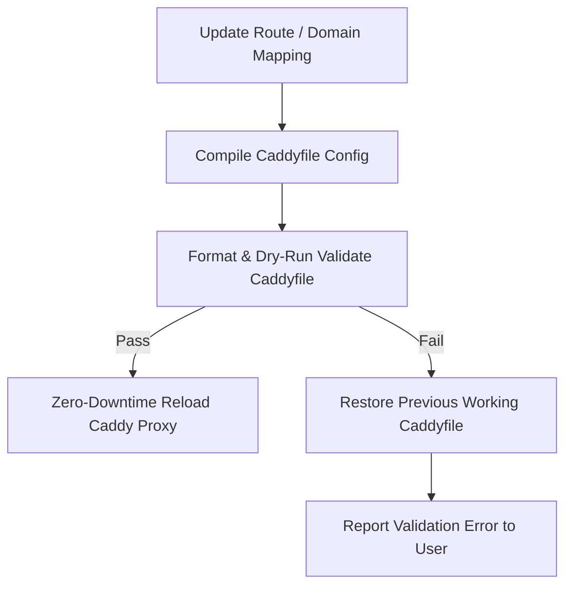

Upstand orchestrates a managed **OpenResty edge** as the public `:80`/`:443`
entry point. The existing **Caddy Web Server** remains the application proxy
behind it, preserving domain mappings, middleware, certificates, and reload
semantics. With `EDGE_ALLOW_FALLBACK=true`, host/path requests without an
explicit managed-edge route are passed to Caddy.

Explicit managed-edge routes are evaluated first. They are useful for
edge-native rate limits, country rules, and traffic policies; they bypass the
Caddy mapping for the matching host/path, so configure their upstream and TLS
policy deliberately.

OpenResty is the only reverse proxy Upstand owns on the public listener. Caddy
is retained as the private compatibility backend for existing domain mappings;
Upstand does not start parallel Traefik or Nginx public edges. If a host already
has one of those proxies, stop or migrate it through the takeover workflow
before assigning ports 80/443 to the managed edge.

The edge image includes a vendored GeoLite2-Country database and the
`lua-resty-maxminddb` lookup binding. Country rules use the client address seen
by OpenResty, never an arbitrary forwarded header. The database is refreshed by
maintainers with `bun run update:geoip` and is not downloaded on a customer
server at runtime. If the database cannot be opened, country rules fail closed
and the edge health endpoint reports `geoIpAvailable: false`.

---

## 1. Domain Configuration

You can assign public domains to Applications, Compose services, and Databases in the resource's **Domains** tab.

A domain mapping consists of:
- **Hostname**: A fully-qualified public domain name (e.g. `api.example.com`). Upstand normalizes hostnames and rejects raw IP addresses, wildcards, and ports.
- **Paths**: A public path prefix (e.g., `/v1`) and an optional internal rewrite destination.
- **Port Mapping**: The target container port (e.g., `3000`).
- **Snippets**: Reusable Caddy configuration snippets imported by name.
- **Path Stripping**: If enabled, strips the prefix before forwarding traffic.

---

## 2. HTTPS & SSL Strategies

Upstand configures and reloads certificates dynamically. You can choose between four certificate strategies:

### Let's Encrypt (Production Default)
- Automatically completes ACME HTTP-01 or TLS-ALPN-01 challenges.
- Optional ACME contact email for certificate expiration alerts and account registration.
- Caddy caches certificates, private keys, and renewal statuses in a persistent volume.
- **Prerequisites**: DNS must resolve to the edge host and TCP ports **80** and **443** must be open publicly. In edge backend mode, Caddy uses internal host ports `8080` and `8443` by default, so those ports should not be exposed publicly.

### ZeroSSL
- Issues certificates via ZeroSSL ACME endpoints with ACME contact email registration.
- Useful when Let's Encrypt rate limits or policy restrictions apply.

### Caddy Internal CA (Self-Signed)
- Generates locally-trusted certificates using Caddy's built-in Certificate Authority.
- Best for staging, local development, or isolated private network deployments.
- *Note: Browsers and clients must manually import the Caddy root certificate to avoid untrusted warning screens.*

### Custom SSL Certificates
- Upload custom SSL certificates and matching private keys under **Infrastructure → Certificates**.
- Select the uploaded certificate directly on domain mappings or main web server domain configurations for enterprise or wildcard TLS management.

---

## 3. Security Headers & Redirects

Configure advanced proxy settings directly inside the domain mapping card:

- **Redirects**: Terminate incoming requests and issue HTTP `301/302/307/308` redirects.
- **Security Headers**: Inject standard headers to secure client connections:
  - `Strict-Transport-Security` (HSTS)
  - `X-Content-Type-Options: nosniff`
  - `X-Frame-Options: DENY`
  - `Referrer-Policy: no-referrer-when-downgrade`

---

## 4. Web Application Firewall (WAF) & Rate-Limiting Snippets

Operators can define reusable Caddy configuration snippets under **Web Server → Caddy Snippets** to enforce ingress WAF protection:

```nginx
# Definition: rate_limit_suite (Saved under Web Server Snippets)
(rate_limit_suite) {
    rate_limit {
        zone dynamic_ip {
            key {remote_host}
            events 100
            window 1m
        }
    }
    header {
        Strict-Transport-Security "max-age=31536000; includeSubDomains; preload"
        X-Content-Type-Options "nosniff"
        X-Frame-Options "DENY"
        X-XSS-Protection "1; mode=block"
    }
}
```

- **IP Allowlisting & Geo-Blocking**: Managed-edge routes can block or restrict access using client IP CIDRs or GeoLite2 country rules. Requests that intentionally stay on the Caddy compatibility fallback can still use provider headers such as `{http.request.header.CF-IPCountry}`.
- **Snippet Import**: Import any defined snippet directly on domain mapping cards by selecting it from the **Caddy Snippets** dropdown menu.

---

## 5. Authentication Middleware

Secure public routes before they hit your applications using Caddy-native authentication filters:

### Basic Authentication
- Prompt visitors for a username and password.
- Upstand accepts and persists **only Caddy-compatible password hashes** (e.g. bcrypt hashes). Plaintext passwords are never stored in the database.

### Forward Authentication
- Delegate access control to a central authentication gateway (e.g. `https://auth.example.com`).
- Caddy makes an out-of-band request to the authorization service prior to proxying.
- If verified, Caddy injects identity headers (such as `X-User-Id` or `X-User-Email`) into the upstream request.

---

## 5. Web Server Configuration Editor

The global Web Server settings page exposes a CodeMirror editor for:
1. **Global Caddy Settings**: Modify load balancing, timeouts, TLS settings, or logging parameters.
2. **Caddy Snippets**: Define named configuration blocks (e.g., rate limit configurations or IP blocks) that can be imported by resource domains.
3. **Configuration Previews**: Displays the compiled read-only Caddyfile for visual audit.

---

## 6. Dynamic SSL & Caddy Ingress Architecture



---

## 7. Atomic Validation & Reload Safety

To prevent web server downtime, Upstand validates all compiled Caddy configurations before applying them:



If Caddy rejects the formatted configuration, the reload is aborted, the previous working configuration remains active, and the operation is safely rolled back.
