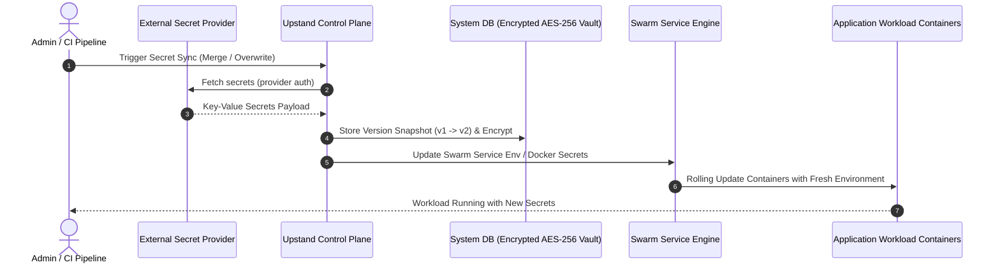
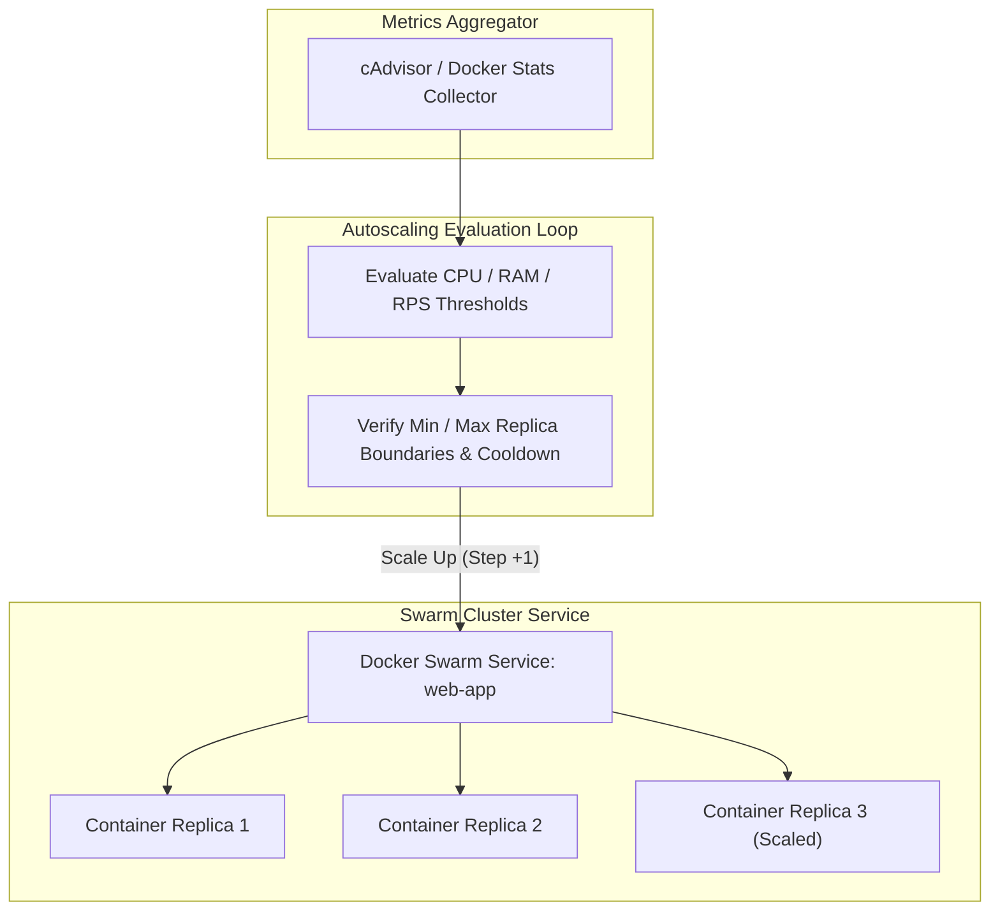

## Versioned secrets

Upstand keeps secret values separate from ordinary resource configuration and supports versioned secret workflows. A version snapshot (`v1`, `v2`, etc.) is logged automatically whenever secrets are modified, synced, or rotated.

- **Version History & Rollback**: From the **Environment** or **Resource** settings tab, click **Version History** to view all recorded snapshots, their creation source (`local`, `Vault`, `AWS`, `Rotation`), and timestamps. Clicking **Restore** reverts the scope's variables to that snapshot and automatically enqueues a workload re-deployment.
- **Security & Access Control**: Secret-management routes require the active organization, relevant RBAC capabilities (`resource:view`, `resource:update`, `environment:update`), and step-up verification when 2FA is enabled. Raw secret values are redacted in browser lists and are never sent to UpGal configuration models.

---

## Secret Management Architecture & Provider Sync



---

## External Secret Providers

Upstand integrates with enterprise secret engines and supports Dokploy-compatible
deployment-time references. Explicit **Sync** imports a versioned snapshot into
the selected Upstand environment/resource. A deployment-time reference is
different: its value is fetched just before deployment, injected into the
resolved deployment inputs, and is never written back to the Upstand database.

### Managing Secret Providers

Navigate to **Integrations → Secret Providers** (`/secret-providers`) to configure organization secret providers:

- **HashiCorp Vault / OpenBao**: Configure `url`, `token`, and optionally `namespace` and `mount`. References use `<path>:<field>`.
- **Infisical**: Configure `siteUrl`, `clientId`, `clientSecret`, `projectId`, and `environmentSlug`. References use the secret name.
- **AWS Secrets Manager**: Configure `region`, `accessKeyId`, and `secretAccessKey`; references may use `<secret-name>` or `<secret-name>:<field>`.
- **AWS Parameter Store**: Configure AWS credentials and use a parameter name/path.
- **Doppler**: Configure `token`, `project`, and `config`; references use the secret name.
- **Azure Key Vault**: Configure `vaultUri`, `tenantId`, `clientId`, and `clientSecret`; references use the secret name.
- **Scaleway Secret Manager**: Configure `projectId`, `secretKey`, and optionally `region`; references support folders and JSON fields.
- **Phase**: Configure `apiUrl`, `token`, `appId`, and `env`; references use the secret name.
- **1Password Connect and legacy Upstand adapters** remain available for existing installations.

All provider credentials are encrypted at rest using AES-GCM (`encryptSecret`) and redacted when listing providers.

### Deployment-time reference syntax

Use the provider's Upstand display name in the reference, not its vendor type:

```dotenv
DATABASE_URL=${{vault.production-doppler.DATABASE_URL}}
STRIPE_KEY=${{vault.production-vault.apps/production:STRIPE_KEY}}
```

The same syntax is supported in environment variables, build environment
variables, build secrets, and Compose values. References are resolved in the
deployment worker for the current organization/project/environment. A missing
provider, provider assignment, reference, or provider response fails closed;
Upstand does not silently substitute an empty value or print the fetched value
in logs.

Provider assignments are optional for backwards compatibility. A provider with
no assignment metadata is available to the organization. When assignments are
configured, select a project and optionally specific environments; an explicit
empty assignment list makes the provider unavailable to deployments. Keep the
provider display name stable because it is part of application configuration.

See the complete [installation and provider reference guide](/docs/getting-started/installation)
for configuration fields, nested-runtime guidance, and upgrade behavior.

---

## Horizontal Pod & Service Autoscaling



---

## Rotation Schedules

Upstand supports both automated background secret rotation and immediate on-demand key rotation:

- **On-Demand Rotation**: Specify target variable key names (e.g., `DB_PASSWORD`, `API_KEY`) and click **Rotate Now**. Upstand generates cryptographically random values, applies them to the scope, and triggers a redeployment.
- **Automated Schedules**: Create a rotation schedule with target keys, an interval in hours (e.g., `168` for weekly), and a generated value length (min 16, max 128 bytes).
- **Concurrency & Claim Locking**: The background runner claims due rotation jobs using atomic lock timestamps (`rotationClaimedUntil`) to prevent duplicate executions in multi-node environments.
- **Workload Re-deployments**: Each rotation logs a new version snapshot and automatically enqueues deployments so running workloads load the newly generated values.

---

## Health Checks & Rollback Integration

Application and Compose resources can define a health check command with interval, timeout, retry count, and start period. Health checks work with the selected deployment strategy and automatic rollback settings. A health-check failure during a rolling update prevents traffic cutover and automatically initiates an image rollback.
