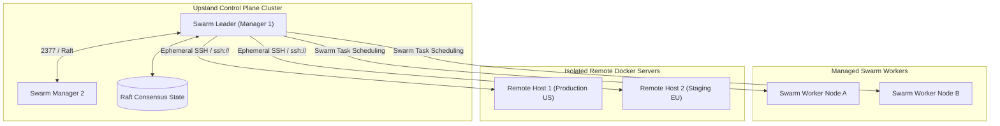
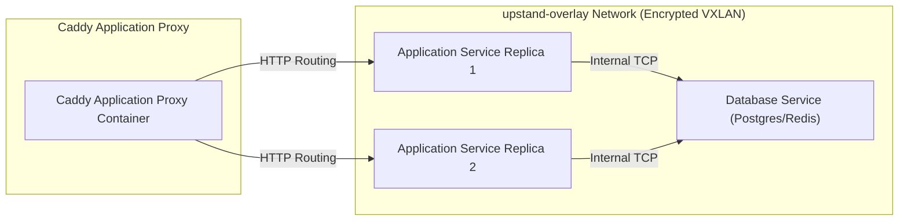

Upstand distinguishes between two deployment topologies: **Remote Servers** (isolated Docker daemons managed over SSH) and **Swarm Nodes** (nodes joined to the central control-plane cluster).

---

## 1. Remote Server & Cluster Topology



---

## 2. Server Network Interaction Architecture



## 2. Remote Server Setup Tutorial

Follow these steps to connect and provision a new remote Docker host:

<Steps>
  <Step>
    ### Choose SSH credentials

    Remote servers support either a password or an SSH key. Passwords are
    encrypted at rest and used only to establish the SSH connection; Upstand
    never copies them into setup logs or terminal output. SSH keys remain the
    recommended option for unattended provisioning.

    To use a key, navigate to **Settings → SSH Keys**, create or import one,
    and install its public key in the target user's `authorized_keys` file.
  </Step>

  <Step>
    ### Configure the target server
    
    Log into your remote server and append the public key to the target user's authorized keys:
    
    ```bash
    echo "ssh-ed25519 AAAAC3..." >> ~/.ssh/authorized_keys
    chmod 600 ~/.ssh/authorized_keys
    chmod 700 ~/.ssh
    ```
  </Step>

  <Step>
    ### Add the server in the Upstand Dashboard
    
    1. Go to the **Remote Servers** tab and click **Add Server**.
    2. Input a name, public IP, SSH Port, SSH User, and choose either Password
       or SSH Key authentication.
    3. Click **Setup Server**.
  </Step>

  <Step>
    ### Automated Provisioning
    
    Upstand runs an automated provisioning playbook:
    - Verifies SSH connectivity.
    - Installs the latest stable Docker Engine if missing.
    - Initializes a single-node Swarm manager.
    - Creates the attachable `upstand-network` overlay network.
    - Spawns Caddy to handle routing on the remote server.
  </Step>
</Steps>

If setup reports that Docker cannot mount an overlay filesystem, the remote
host is not currently capable of running the required Docker image layers.
Docker Engine 29 and later may report this as the `overlayfs` containerd
snapshotter. This is common with rootless Docker, unprivileged LXC/Incus
containers, restricted VPS kernels, or Docker data stored on an unsupported
filesystem. Enable nesting, `keyctl`, and the host overlayfs capability where
applicable, or use a rootful Docker Engine on ext4 or XFS with `ftype=1`;
then verify `docker run --rm hello-world` and retry setup. Do not delete
Docker's data directory or switch storage drivers without first backing up
images and containers.

---

## 3. Managing the Swarm Cluster

The **Docker Swarm** page manages the physical hosts clustered with the Upstand control plane:

- **Join Tokens**: Reveal and rotate Join Tokens for workers or managers. Rotating a token instantly revokes all prior tokens.
- **Join Command**: Copy the join command and execute it on a worker node:
  ```bash
  docker swarm join --token <JOIN_TOKEN> <MANAGER_IP>:2377
  ```
- **Node Draining**: Before performing server maintenance, update the node status to `drain`. Swarm will immediately reschedule eligible container tasks to other healthy nodes.
- **Safe Node Removal**: Removing a node drains it first and verifies cluster quorum. Upstand protects managers by refusing to remove the Swarm Leader, the local control-plane manager, or the last manager in the cluster.
- **Race Condition Prevention**: Swarm node updates use Docker object version hashing. If node state changes concurrently, the update is safely rejected.
