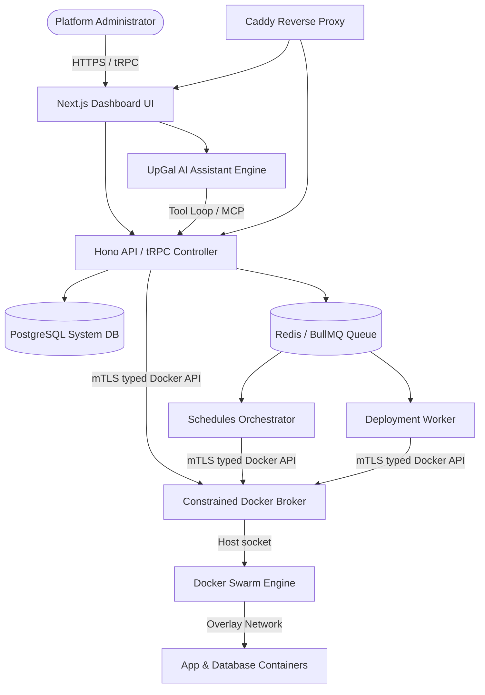

Welcome to **Upstand**, a modern, container-first self-hosted Platform-as-a-Service (PaaS) designed to manage, deploy, and scale application workloads, multi-container Compose stacks, and persistent databases across single-node or multi-node Docker Swarm clusters.

Upstand consolidates server management, SSL termination, Git build queues, backups, monitoring, and user authentication into a unified dashboard, backed by **UpGal**, your AI operations assistant.

---

## Architectural Layout

Upstand is engineered following a clean package-based architecture. The Hono/TypeScript control plane persists state in PostgreSQL, dispatches durable work through Redis/BullMQ, and delegates Docker operations through a constrained, mutually authenticated broker. Remote Docker hosts are managed through verified SSH sessions; the control plane does not expose a host Docker socket to application services.



---

## Production Quickstart

Use the [production self-hosting guide](/docs/getting-started/self-hosting) and
the audited installer for production deployments. The installer creates the
encrypted, attachable Swarm network, pins every Upstand image to an immutable
digest, provisions file-backed secrets, and runs the migration and runtime
acceptance checks.

Pin the exact release tag that has been reviewed before downloading the
installer:

```bash
export UPSTAND_VERSION="vX.Y.Z" # replace with the reviewed stable release tag
curl --fail --silent --show-error --location --proto '=https' --tlsv1.2 \
  "https://raw.githubusercontent.com/UpstandPlatform/upstand/${UPSTAND_VERSION}/install.sh" \
  | sudo -E bash
```

Do not use a mutable `latest` image, a mutable branch URL, plaintext database
credentials, or a direct Docker Compose deployment for production. The
installer creates the broker and its mTLS identities; only the broker receives
the host Docker socket.

For a local development or evaluation environment, use the repository's
development setup instructions instead of adapting a production deployment.

---

## Key Features

<Cards>
  <Card title="Application & DB Deployments" href="/docs/features/deployments">
    Build from Git, Nixpacks, Railpacks, or Dockerfiles. Deploy PostgreSQL, Redis, MongoDB, MySQL, and MariaDB.
  </Card>
  <Card title="Domains & Automatic HTTPS" href="/docs/features/routing">
    Automatic Let's Encrypt certificates managed dynamically via an integrated Caddy reverse proxy.
  </Card>
  <Card title="Remote Server Management" href="/docs/features/servers">
    Manage independent Docker hosts securely over SSH without exposing Docker sockets to the public internet.
  </Card>
  <Card title="Monitoring and Audit" href="/docs/features/monitoring">
    Inspect live and historical health data, then correlate incidents with searchable audit events.
  </Card>
  <Card title="Templates" href="/docs/features/templates">
    Search, review, create, and deploy organization or built-in Compose templates.
  </Card>
  <Card title="UpGal AI Assistant" href="/docs/operations/upgal">
    Control, inspect, and deploy your infrastructure using natural language with built-in UI approvals.
  </Card>
</Cards>

---

## Core Technologies

Upstand leverages state-of-the-art technologies to ensure stability, speed, and safety:

- **Next.js & Hono**: Ultra-fast dashboard UI and API routing with complete type safety over tRPC.
- **Drizzle ORM & PostgreSQL**: Structured data persistence with robust transactional schemas.
- **BullMQ & Redis**: High-performance, distributed job queuing to serialize builds and monitor tasks.
- **Docker Swarm**: Built-in container clustering, overlay networking, service replica rollouts, and rolling updates.
- **Better Auth**: Multi-tenant authentication, including email/password login, 2FA, API Keys, OIDC/SAML SSO, and SCIM provisioning.
