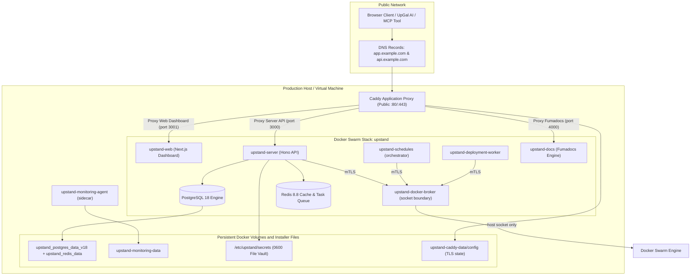

This guide outlines the production installation process, environment variable options, system prerequisites, and the security model for Upstand.

---

## Infrastructure Architecture

Upstand's production self-hosting architecture separates public routing, the
control-plane services, persistent data, and Docker control traffic into
isolated Docker Swarm networks. The broker is the only control-plane service
that receives the host Docker socket; the server, schedules orchestrator, and
deployment worker use its constrained mTLS API.



The installer creates both the application overlay (`upstand-network`) and the
encrypted internal Docker-control overlay (`upstand-docker-control`), then
creates the broker's CA, server certificate, caller certificates, and scoped
tokens as Docker secrets. Caddy is a separate host-level container managed by
Upstand's infrastructure integration and routes public HTTPS traffic to the
private stack services.

---

## Server Prerequisites

Prepare a fresh Linux Virtual Machine matching these requirements:

1. **Host OS**: Ubuntu 24.04 LTS, Ubuntu 22.04 LTS, or Debian 12 (Bookworm) is recommended.
2. **Hardware**: At least 2 vCPUs, 4 GB of RAM, and 30 GB of SSD storage.
3. **DNS Configuration (optional for first boot)**: Configure A records pointing to your server's public IP when you are ready to use the managed HTTPS domain:
   - `app.example.com` (for the dashboard UI)
   - `api.example.com` (for the Hono/tRPC API server)
   - `docs.example.com` (for the documentation app)
4. **Firewall Rules**:
   - Open public TCP **80** and **443** for Caddy. The API, dashboard, scheduler, and documentation services remain private to the Swarm network.
   - For multi-node Swarms, restrict TCP **2377** (cluster management), TCP/UDP **7946** (node communication), and UDP **4789** (overlay network ingress) to your internal cluster network.

---

## Installation Modes

The Upstand installer supports two compilation strategies:

- **Release Images (Recommended)**: Pulls immutable pre-built images from the GitHub Container Registry (`ghcr.io`). Highly recommended for production stability and repeatability.
- **GitHub Source Build**: Clones the public `@upstand` repository directly onto your manager node and builds the Docker images locally. Best for evaluation or testing local patches.

---

## Installation Walkthrough

<Steps>
  <Step>
    ### Prepare the environment variables
    
    Configure the HTTPS origins before running the installer. It will generate cryptographic secrets under `/etc/upstand/secrets/`, resolve the selected stable release, verify its immutable GitHub release manifest and deployment-artifact hashes, and pull the exact published GHCR image digests. Releases without deployment-artifact hashes are rejected. Source builds require the explicit `UPSTAND_BUILD_FROM_SOURCE=true` opt-in.

    For a production deployment with DNS and pre-built immutable images, export your target domains first. The release manifest supplies the service image digests; do not copy a partial image list from an older installation:
    
    ```bash
    export BETTER_AUTH_URL=https://api.example.com
    export CORS_ORIGIN=https://app.example.com
    export NEXT_PUBLIC_SERVER_URL=https://api.example.com
    
    ```
  </Step>

  <Step>
    ### Run the installation script
    
    Execute the bootstrap command to download and run the installer:
    
    ```bash
    export UPSTAND_VERSION="vX.Y.Z" # replace with the reviewed stable release tag
    curl -fsSL "https://raw.githubusercontent.com/UpstandPlatform/upstand/${UPSTAND_VERSION}/install.sh" | sudo -E bash
    ```

    Keep `UPSTAND_VERSION` pinned to the exact release tag that was reviewed;
    do not install production systems from the mutable `master` branch.

    If the recommended CPU, memory, or Docker disk capacity is unavailable, the installer prints a warning and continues. The minimum recommendation is 2 vCPUs, 4 GB RAM, and 30 GB free Docker storage.
  </Step>

  <Step>
    ### Verify the service statuses
    
    Once the installer finishes, verify that all services are running and reporting ready:
    
    ```bash
    # Check Swarm stack state
    docker stack services upstand
    
    # Query API health status
    curl -fsS https://api.example.com/health/ready
    ```
  </Step>
</Steps>

Production installs expose only Caddy on `:80/:443`; the API, dashboard, scheduler, and database services remain on the private Swarm network. Configure `BETTER_AUTH_URL`, `CORS_ORIGIN`, and `NEXT_PUBLIC_SERVER_URL` as HTTPS origins before installation. An insecure direct-IP bootstrap requires the explicit `UPSTAND_ALLOW_INSECURE_BOOTSTRAP=true` opt-in and is limited to the first self-hosted account; after that account exists, direct-IP HTTP requests are rejected and the instance must be accessed through HTTPS.

---

## Configuration & Storage Layout

The installer isolates configuration from secrets to protect credentials:

- **/etc/upstand/.env**: Stores non-secret environment variables, origins, and image digests. Pinned with mode `0600`.
- **/etc/upstand/secrets/**: Stores sensitive credentials (Postgres passwords, Redis keys, SSH keys, encryption keys) as individual `0600` files. Injected directly into containers as Docker Secrets.

> [!CAUTION]
> **Secret Key Management:** Ensure you back up `/etc/upstand/` securely. The cluster master key (`ENCRYPTION_KEY_V1`) is used to encrypt database secrets and credentials at rest; losing it makes stored tokens, passwords, and SSH keys unrecoverable.

---

## Database image upgrades

New installations use PostgreSQL 18 and Redis 8.8. Before upgrading an existing
installation, follow the [database upgrade runbook](/docs/operations/database-upgrades).
The installer refuses to deploy over a populated legacy PostgreSQL volume until
the PostgreSQL dump/restore migration has created `upstand_postgres_data_v18`.

---

## Outage Resilience & Rate Limiting

To maintain uptime, the Hono API integrates an in-process rate-limiting fallback that activates if Redis is down:

- **Redis Online**: Employs a distributed sliding window rate limiter in Redis.
- **Redis Offline Fallback**: Switches to a local, memory-bounded token bucket limiter.
- **Emergency Limits**: Unauthenticated endpoints allow up to 20 requests/min; sensitive mutation routes allow 15/min; authenticated reads allow 30/min per active identity.
- The `/health/ready` endpoint flags whether this local fallback mode is currently active.

---

## Swarm Advertise Address Configuration

During Docker Swarm initialization, Docker requires a routable IP address or interface using the `--advertise-addr` parameter to bind cluster communications.

### Automatic Detection
By default, the installer automatically detects the server's primary IP address using standard routing lookup:
```bash
ip -4 route get 1.1.1.1
```

### Manual IP Override
If you have multiple network interfaces, run behind a firewall/NAT, or want to specify a manual IP, set the `SWARM_ADVERTISE_ADDR` environment variable before running the installer:
```bash
export SWARM_ADVERTISE_ADDR=192.168.1.50
    export UPSTAND_VERSION="vX.Y.Z" # replace with the reviewed stable release tag
curl -fsSL "https://raw.githubusercontent.com/UpstandPlatform/upstand/${UPSTAND_VERSION}/install.sh" | sudo -E bash
```

Alternatively, run the installer with the `--interactive` flag to be prompted for the IP address interactively:
```bash
    export UPSTAND_VERSION="vX.Y.Z" # replace with the reviewed stable release tag
curl -fsSL "https://raw.githubusercontent.com/UpstandPlatform/upstand/${UPSTAND_VERSION}/install.sh" | sudo -E bash -s -- --interactive
```

---

## Direct stack deployment

Directly creating `/etc/upstand/.env` and running `docker stack deploy` is not
a supported production installation path. It bypasses release-manifest
verification, mTLS secret generation, the migration barrier, encrypted-network
checks, the broker contract, and the post-deploy health probes. Use the
versioned installer for initial installs and upgrades; it is safe to rerun
after backing up `/etc/upstand/` and the database.

---

## Uninstalling Upstand

To completely remove the Upstand control plane, services, and associated data volumes from your server:

### 1. Remove the Docker Stack
This tears down all running containers, services, and routing rules:
```bash
sudo docker stack rm upstand
```

### 2. Delete configuration and persistent volumes
> [!CAUTION]
> **Data Loss:** This will permanently delete your Postgres database, Redis store, and Caddy runtime state. Backup any important data before running this.
```bash
sudo rm -rf /etc/upstand
sudo docker volume rm upstand_postgres_data_v18 upstand_redis_data upstand_caddy_data upstand_caddy_config
```

### 3. Remove the Docker Overlay Network
```bash
sudo docker network rm upstand-network
```

### 4. Leave Docker Swarm
If this server is not hosting any other Swarm services, leave the Swarm cluster:
```bash
sudo docker swarm leave --force
```
