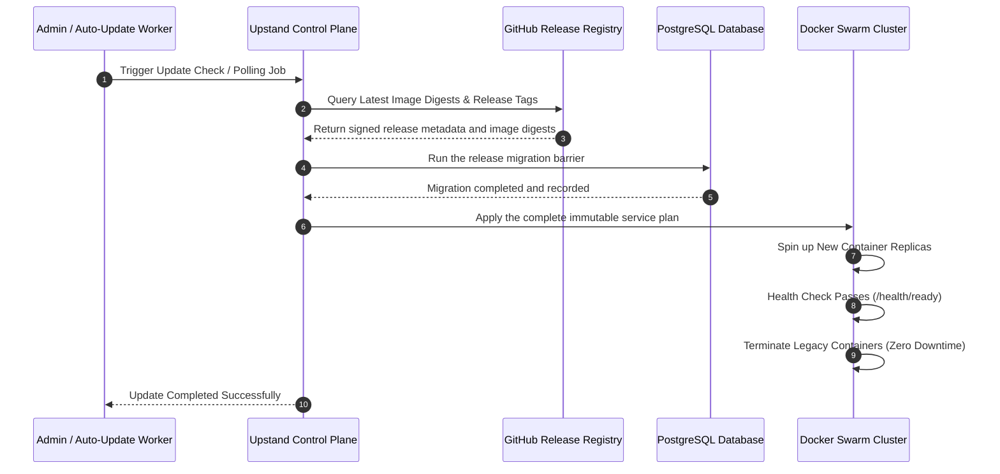

Upstand provides multiple options to apply updates, from automated background upgrades to controlled manual rollouts.

---

## Update & Migration Lifecycle Pipeline



---

## Update Channels

Upstand exposes four runtime channels:

| Channel | Branch | Recommendations |
| --- | --- | --- |
| **Stable** | `master` / Tags (`vX.Y.Z`) | Production environments. The release manifest resolves every service image to an immutable digest. |
| **Canary** | `canary` | Test/staging environments. Rolling updates with the latest commits. |
| **Source** | Repository checkout/build | Development and explicitly opted-in source builds. Not a verified release artifact. |
| **Managed** | Upstand-operated cloud | Provider-controlled rollout. Tenants cannot mutate the cloud control-plane services. |

> [!WARNING]
> **Mutable Tags**: Never use mutable tags like `latest` or `canary` directly in production stacks. Always resolve tags to their immutable SHA-256 digests in `/etc/upstand/.env`.

---

## Safe Manual Update Procedure

To update a self-hosted production instance to a newer version manually:

1. **Back up your database**: Export your current Postgres database and configuration.
2. **Review the release**: Confirm the tag, changelog, release manifest, image provenance, and deployment-artifact hashes.
3. **Pin the reviewed tag and rerun the installer**:
   ```bash
   export UPSTAND_VERSION="vX.Y.Z"
   curl --fail --silent --show-error --location --proto '=https' --tlsv1.2 \
     "https://raw.githubusercontent.com/UpstandPlatform/upstand/${UPSTAND_VERSION}/install.sh" \
     | sudo -E bash
   ```
   The installer resolves all required images from that release manifest and
   updates the stack specification as one unit. Do not update only one image
   or hand-edit a subset of `/etc/upstand/.env`.
4. **Confirm state**: Check `docker stack services upstand`, the migration task,
   `/health/ready`, and the public dashboard origin before declaring success.

---

## Automatic Updates

Update availability checks are opt-in and run every 30 minutes when enabled:

- **Enabling**: Add `UPSTAND_AUTO_UPDATE=true` to your `/etc/upstand/.env` and re-run the installer.
- **Behavior**: The schedules service checks the GitHub release API and publishes a deduplicated notification when a matching release is available. Applying a release still goes through the authenticated update action or the installer; this is not an unattended `latest` tag pull.
- **Exclusion**: Source builds are never updated automatically to prevent overriding local changes.

---

## Checking Update Status

You can trigger a manual check for updates from:
- **Web Server → Check for updates**
- **Settings → Check for updates**

## Cloud and Remote Servers

Cloud control planes are updated by Upstand's managed rollout. The dashboard
therefore exposes the current version and channel but does not allow a tenant
to mutate the platform services.

Remote servers are separate Docker hosts. A control-plane release does not
silently replace workloads on those hosts. After a self-hosted control-plane
update, use **Remote Servers → Set up again** for each affected remote server;
the idempotent provisioning flow pulls the release-pinned monitoring image,
recreates the monitoring agent, and preserves the server's Docker workloads.
This explicit action avoids taking remote application traffic down as a side
effect of a platform update.

Both interfaces read from cached state that queries the GitHub releases API. A
manual refresh forces a fresh request to GitHub, bypassing the cache.

---

## Safe Rollback

If a release introduces issues, roll back by modifying the image digests in `/etc/upstand/.env` to the previous known-good values, and run the installer again. Docker Swarm will redeploy the services to their prior specifications.

> [!IMPORTANT]
> **Keep Credentials Intact**: Do not modify or rotate Docker secret keys under `/etc/upstand/secrets/` during an image rollback, as the database scheme remains backward compatible.
