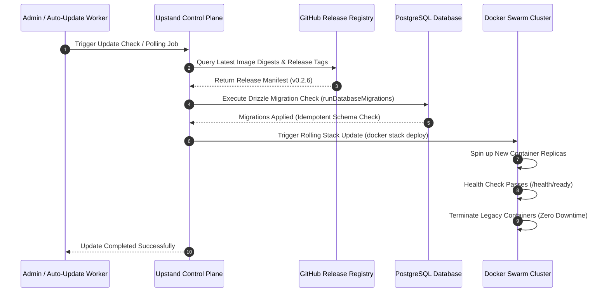

Upstand provides multiple options to apply updates, from automated background upgrades to controlled manual rollouts.

---

## Update & Migration Lifecycle Pipeline



---

## Update Channels

Upstand exposes four runtime channels:

| Channel | Branch | Recommendations |
| --- | --- | --- |
| **Stable** | `master` / Tags (`vX.Y.Z`) | Production environments. Uses versioned image tags. |
| **Canary** | `canary` | Test/staging environments. Rolling updates with the latest commits. |
| **Source** | Repository checkout/build | Development and explicitly opted-in source builds. Not a verified release artifact. |
| **Managed** | Upstand-operated cloud | Provider-controlled rollout. Tenants cannot mutate the cloud control-plane services. |

> [!WARNING]
> **Mutable Tags**: Never use mutable tags like `latest` or `canary` directly in production stacks. Always resolve tags to their immutable SHA-256 digests in `/etc/upstand/.env`.

---

## Safe Manual Update Procedure

To update your production instance to a newer version manually:

1. **Back up your database**: Export your current Postgres database and configuration.
2. **Review the release**: Check its changelog and database compatibility. Keep the installed version and image pins in `/etc/upstand/.env` unchanged until the installer applies the new release.
3. **Select the release**: Export the exact audited tag, then download and run that release's installer:
   ```bash
   export UPSTAND_VERSION="vX.Y.Z" # replace with the audited stable release tag
   curl --fail --silent --show-error --location --proto '=https' --tlsv1.2 \
     "https://raw.githubusercontent.com/UpstandPlatform/upstand/${UPSTAND_VERSION}/install.sh" \
     | sudo -E bash
   ```
4. **Wait for rollout**: The installer resolves the selected release manifest, updates the saved application image pins, and waits for migrations and service readiness. Availability during rollout depends on capacity, replica counts, and migration compatibility.
5. **Confirm state**: Check `docker stack services upstand` and `/health/ready` to ensure services have fully restarted.

Upgrades preserve credentials, origins, and bundled PostgreSQL/Redis services.
Saved external database endpoints remain external. To move to external data
services, configure both `DATABASE_URL` and `REDIS_URL` together after following
the data migration runbook; changing these URLs does not migrate data.

Custom application images can be supplied through explicit `UPSTAND_*_IMAGE`
environment overrides, each pinned to a digest. Re-export those overrides when
changing releases; saved pins belong to the previous rollout. Avoid exporting
the entire saved `.env` before an upgrade, since that supplies old images as
explicit overrides. The installer reads persisted configuration itself.

---

## Automatic Updates

Automatic updates are opt-in and check for new tags every 30 minutes:

- **Enabling**: Add `UPSTAND_AUTO_UPDATE=true` to your `/etc/upstand/.env` and re-run the installer.
- **Behavior**: The server monitors GitHub releases on your active channel, applies tags matching your channel, and roll out the stack rolling updates.
- **Exclusion**: Source builds are never updated automatically to prevent overriding local changes.

---

## Checking Update Status

You can trigger a manual check for updates from:
- **Web Server → Check for updates**
- **Settings → Check for updates**

## Cloud and Remote Servers

Cloud control planes are updated by Upstand's managed rollout. The dashboard
therefore exposes the current version and channel but does not allow a tenant
to mutate the platform services.

Remote servers are separate Docker hosts. A control-plane release does not
silently replace workloads on those hosts. After a self-hosted control-plane
update, use **Remote Servers → Set up again** for each affected remote server;
the idempotent provisioning flow pulls the release-pinned monitoring image,
recreates the monitoring agent, and preserves the server's Docker workloads.
This explicit action avoids taking remote application traffic down as a side
effect of a platform update.

Both interfaces read from a cached state that queries the GitHub releases API. Clicking either forces a fresh HTTP request to GitHub, bypassing the 30-minute cache.

---

## Safe Rollback

Before rolling back, verify that the previous application release supports the
currently applied database schema. Then rerun the previous audited release's
installer with its exact `UPSTAND_VERSION` and its known-good image digests as
explicit environment overrides. Older installer versions may otherwise retain
the current rollout's saved pins. Check migration and service readiness after
the rollback; an image rollback does not undo database migrations.

> [!IMPORTANT]
> **Keep Credentials Intact**: Preserve Docker secret keys under `/etc/upstand/secrets/` during an image rollback. Database compatibility must be verified for the particular releases involved.
