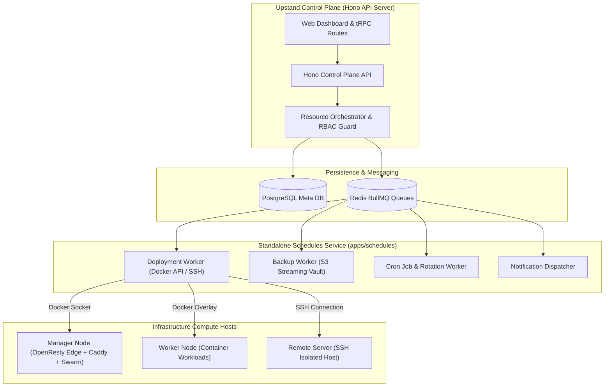

Upstand provides operational management for compute hosts, Docker Swarm clusters, the managed OpenResty public edge, the Caddy application proxy, and background monitoring workers.

---

## Subsystem Control-Plane Architecture

For detailed queue worker specifications and job conventions, see [Schedules, Workers & Queue Architecture](/docs/operations/schedules-workers).

---

## Remote Server Lifecycle

Use **Infrastructure → Remote Servers** to add a host with a name, SSH address/port, username, and organization SSH key. Choose a role before provisioning:

- **Deploy**: Swarm, the public OpenResty edge, Caddy application proxy, and monitoring.
- **Build**: Docker build capacity and monitoring.
- **Database**: Swarm database capacity and monitoring.

The wizard saves connection details, runs setup, and reports status. Removing a server registration does not delete workloads already present on the host; it removes the server from Upstand's organization inventory.

## Swarm operations

**Docker Swarm** shows cluster information and nodes. Authorized operators can initialize the cluster, retrieve join commands, update node availability/role, drain and remove nodes, and rotate join tokens. Draining a node changes scheduling and should be coordinated with capacity and replica requirements.

## Docker inventory

**Docker Inventory** provides read and operational views for containers, images, volumes, networks, and Swarm services. Inspect raw Docker responses and bounded logs when needed. Stop/remove controls are destructive and should be used only after confirming the selected server and object.

## Managed edge, Web Server, and Caddy

The Web Server page manages the OpenResty edge takeover state, routes, rules,
traffic, adoption, and migration workflows. Its compatibility section retains
the existing Caddy settings, environment values, snippets, previews, logs,
health checks, backup settings, Docker cleanup, and GPU detection/configuration.
When edge backend mode is enabled, OpenResty owns public `:80` and `:443`,
while Caddy is reconciled to internal backend ports (`8080`/`8443` by default).
Existing domain mappings continue through the Caddy fallback; an explicit
managed-edge route takes precedence for its host/path.

Daily Docker cleanup is configurable from the Web Server page. Cleanup affects unused host Docker state; do not enable it until you understand which images, volumes, containers, and build cache are considered unused by the operation.

## Monitoring agent

Monitoring is installed according to server role. The dashboard can read current Docker/server state and bounded historical CPU, memory, disk, network, load, and application/container metrics when available. A monitoring failure should be investigated separately from a workload failure: the absence of a metric does not prove the workload is down.

## Control-plane maintenance

The server control plane handles API requests, database migrations, and outbox event creation. Background jobs, outbox publishing, notification delivery, backup executions, deployment builds, and autoscaling are executed exclusively by the standalone `schedules` service. Keep PostgreSQL, Redis, and Docker volumes intact during diagnosis.
