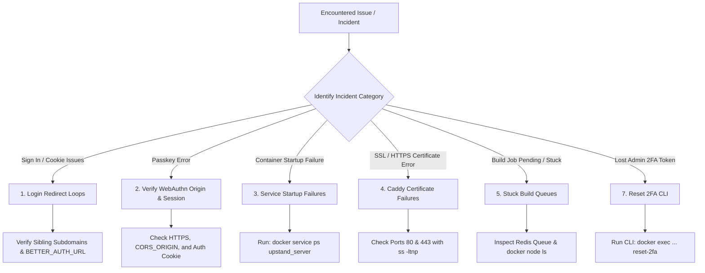

Use these reference charts and commands to diagnose and recover from common Upstand control plane or node issues.

---

## Diagnostic & Troubleshooting Decision Tree



---

## 1. Login Redirect Loops

**Symptom**: Signing in successfully redirects you back to the sign-in page immediately, or session cookies are rejected.

- **Root Cause**: Next.js and Hono must run as sibling subdomains under the same root domain (e.g. `app.example.com` and `api.example.com`) for session cookies to be accepted across origins.
- **Fix**:
  1. Verify the cookie domain settings in Better Auth.
  2. Clear old browser cookies matching `upstand`.
  3. Ensure `BETTER_AUTH_URL` and `CORS_ORIGIN` are set to sibling domains.

---

## 2. Passkey registration or listing failures

**Symptoms**: Settings shows `Unable to load passkeys`, or registering a
credential ends with `Unable to add passkey`.

Check the browser's request origin and the response status before changing
server state:

1. Open the dashboard through its configured HTTPS origin, not a different
   hostname or port. WebAuthn binds credentials to that origin.
2. Confirm `CORS_ORIGIN` is the dashboard origin and `BETTER_AUTH_URL` is the
   API origin. The versioned installer preserves these values while updating
   images.
3. Confirm the request reaches `/api/auth/passkey/list-user-passkeys` and
   includes the session cookie. An unauthenticated list request returning `401`
   is expected; an authenticated request must be made from the configured
   dashboard origin.
4. If the route is missing or returns a server error, verify the server image
   and migration task belong to the same release. Do not expose the endpoint
   without authentication or manually edit the generated auth schema.

Better Auth 1.7 stores an issuer on every account. During an upgrade from an
older Upstand release, the migration task adds that column and the server
normalizes existing credential and Google accounts before serving requests.
Keep the migration and server images on the same release and wait for the
migration task to complete; a mixed release can produce the same passkey and
sign-up errors.

---

## 3. Service Startup Failures

**Symptom**: The installer reports that services are not ready or are failing their health checks.

- **Check Logs**: Run these commands on your Swarm Manager node:
  ```bash
  # List all stack services and replica counts
  docker stack services upstand
  
  # Inspect task histories and errors
  docker service ps upstand_server --no-trunc
  
  # Fetch the last 100 lines of server logs
  docker service logs upstand_server --tail 100
  ```
- *Note: Do not delete Docker volumes (`upstand_postgres_data` or `upstand_redis_data`) during diagnosis, as they contain the control plane database state.*

---

## 4. Caddy Certificate Issuance Failures

**Symptom**: Host domains route successfully over HTTP but fail to resolve over HTTPS with TLS errors.

- **DNS Check**: Run `dig +short yourdomain.com` to confirm it points to the manager node IP.
- **Port Conflict Check**: Ensure ports **80** and **443** are not bound by host-level processes:
  ```bash
  sudo ss -ltnp '( sport = :80 or sport = :443 )'
  ```
- **Inspect ACME Logs**: View Caddy's certificate logs:
  ```bash
  docker logs upstand-caddy --tail 100
  ```

---

## 5. Stuck Build Queues

**Symptom**: Deployments are showing as `queued` or `building` indefinitely.

- **Diagnostics**:
  1. Inspect the deployment log panel in the dashboard to find the failing build stage.
  2. Verify if the target node is online: `docker node ls`.
  3. Inspect the deployment-worker and schedules services: `docker service logs upstand_deployment-worker` and `docker service logs upstand_schedules`.
- **Force Clearing**: If a build worker crashes, you can manually clear the queue using the **Queue Cleanup** action on the Web Server page, but verify no legitimate builds are running first.

---

## 6. Redis Memory Overcommit Warning

**Symptom**: Redis logs `Memory overcommit must be enabled` during startup or
background persistence.

Redis can remain available while this warning is present, but background saves,
replication, or failover can fail when the host is under memory pressure. Apply
the setting on every host that runs Redis:

```bash
sudo sysctl -w vm.overcommit_memory=1
printf 'vm.overcommit_memory = 1\n' | sudo tee /etc/sysctl.d/99-upstand-redis.conf
sudo sysctl --system
```

Verify it with `sysctl vm.overcommit_memory`. This is a host kernel setting; it
cannot be fixed from the Redis container alone. Keep the Redis volume intact
when applying the change.

---

## 7. Database Schema Generation on Windows

**Symptom**: Running database schema updates on a Windows development machine throws path or variable errors.

- **Fix**:
  - Run the following command from the repository root:
    ```bash
    bun run db:generate
    ```
  - The script automatically provisions local mock environment variables for Better Auth. If overridden, manually supply valid `BETTER_AUTH_URL`, `CORS_ORIGIN`, `BETTER_AUTH_SECRET`, and `DATABASE_URL` values to the command context.

---

## 8. Resetting Two-Factor Authentication (2FA)

**Symptom**: An administrator or user has lost access to their TOTP authenticator application or backup codes and cannot complete sign-in.

- **Fix**: Execute the administrative CLI tool inside the running server container to disable 2FA for the target user.

  1. Locate the running `upstand_server` container on your Swarm manager:
     ```bash
     docker ps | grep upstand_server
     ```

  2. Run the CLI tool interactively to select the user and reset their 2FA state:
     ```bash
     docker exec -it <container-id> bun apps/server/dist/cli.mjs reset-2fa
     ```
     *The tool will display a numbered list of all users with active Two-Factor Authentication. Enter the number corresponding to the target user.*

  3. Alternatively, bypass the interactive prompt by passing the user's email directly:
     ```bash
     docker exec -it <container-id> bun apps/server/dist/cli.mjs reset-2fa --email=operator@example.com
     ```
