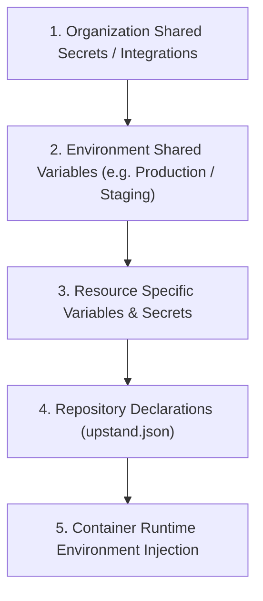

The server validates its environment with `packages/env/src/server.ts`; the web console validates its public variables with `packages/env/src/web.ts`. Optional values have defaults or enable specific integrations. A variable mentioned in a deployment file is not necessarily read by the application, so use this page together with the installer and compose files for your deployment mode.

---

## Variable Resolution & Inheritance Hierarchy

Upstand resolves environment variables across multiple scope levels, where lower levels override upper levels:

The expansion engine supports dynamic references like `${{env.API_URL}}` or `${{project.SECRET_KEY}}`, allowing resources within the same environment to share endpoints dynamically.

---

## Server Runtime Variables

| Variable | Required | Purpose |
| --- | --- | --- |
| `DATABASE_URL` | Production | PostgreSQL connection string. |
| `UPSTAND_DATABASE_POOL_MAX` | No | Maximum PostgreSQL connections per process; defaults to `20`, maximum `100`. Multiply by server and scheduler replicas when sizing PostgreSQL. |
| `UPSTAND_DATABASE_POOL_IDLE_TIMEOUT_MS` | No | How long an idle PostgreSQL pool connection remains open; defaults to `30000`. |
| `UPSTAND_DATABASE_POOL_CONNECTION_TIMEOUT_MS` | No | Maximum time to establish a PostgreSQL connection; defaults to `5000`. |
| `BETTER_AUTH_SECRET` | Production | Better Auth signing/session secret; the server schema requires at least 32 characters. |
| `BETTER_AUTH_URL` | Production | Canonical auth API URL. |
| `CORS_ORIGIN` | Production | Allowed dashboard origin. |
| `UPSTAND_ALLOW_INSECURE_BOOTSTRAP` | No | Explicit isolated-host exception for direct-IP HTTP during first-account bootstrap; direct HTTP is rejected after the first self-hosted account exists. Keep `false` for normal production operation. |
| `ENCRYPTION_KEY_V1` | Production | Master 256-bit encryption key for stored database secrets and provider credentials. |
| `REDIS_URL` | No | Redis connection URL; defaults to `redis://localhost:6379`. |
| `UPSTAND_DATABASE_URL` | No | Installer alias for an external PostgreSQL connection URL; stored as a Docker secret. |
| `UPSTAND_REDIS_URL` | No | Installer alias for an external Redis connection URL; stored as a Docker secret. |
| `PORT` | No | Server listen port; defaults to `3000`. |
| `NODE_ENV` | No | `development`, `production`, or `test`; defaults to `development`. |
| `DOCKER_NETWORK` | No | Docker network name; defaults to `upstand-network`. |
| `TRUSTED_PROXY_CIDRS` | No | Comma-separated proxy CIDRs whose forwarded client headers may be trusted. |

## URLs and deployment topology

| Variable | Purpose |
| --- | --- |
| `UPSTAND_BASE_URL` | Optional public Upstand base URL. |
| `APP_URL` | Optional application/dashboard URL. |
| `UPSTAND_DASHBOARD_HOST` | Dashboard host used by deployment configuration. |
| `UPSTAND_API_HOST` | API host used by deployment configuration. |
| `UPSTAND_DOCS_HOST` | Documentation host used by deployment configuration. |
| `UPSTAND_SERVER_UPSTREAM` | Server upstream override. |
| `UPSTAND_WEB_UPSTREAM` | Web upstream override. |
| `UPSTAND_FUMADOCS_UPSTREAM` | Fumadocs upstream override. |
| `UPSTAND_DIRECT_ORIGINS` | Installer-managed explicit bootstrap mode for direct host-IP origins. Production defaults to `false`; enable only during isolated HTTP bootstrap. |
| `DOCKER_CONTROL_NETWORK` / `UPSTAND_DOCKER_CONTROL_NETWORK` | Installer-managed encrypted internal overlay used by the Docker broker and its mTLS callers. It must be distinct from `DOCKER_NETWORK`. |
| `UPSTAND_SERVER_PORT` / `UPSTAND_WEB_PORT` / `UPSTAND_DOCS_PORT` | Published host ports for the API, dashboard, and documentation services. |
| `UPSTAND_CONTROL_PLANE_SSH_HOST_KEY_FINGERPRINT` | Optional host-key pin for control-plane SSH operations. |

## Release and runtime services

| Variable | Purpose |
| --- | --- |
| `UPSTAND_VERSION` | Installer-selected stable release tag. The installer uses the matching release manifest to resolve every required image and deployment artifact; keep it set to the reviewed tag when upgrading an existing installation. |
| `UPSTAND_AUTO_UPDATE` | Boolean; enables scheduled release-availability checks and notifications. It does not pull mutable `latest` images or silently apply an unattended deployment. Defaults to `false`. |
| `UPSTAND_ALLOW_SINGLE_REPLICA` | Installer acknowledgement for a single-node or bundled-data operating model. It does not make PostgreSQL, Redis, or the control plane highly available. |
| `UPSTAND_ALLOW_UNOBSERVED_PRODUCTION` | Explicitly acknowledges that production telemetry is not configured when `OTLP_ENDPOINT` is absent. Prefer configuring OTLP instead of enabling this exception. |
| `UPSTAND_SERVER_IMAGE` | Server image reference. |
| `UPSTAND_SCHEDULES_IMAGE` | Lean schedules-orchestrator image reference. |
| `UPSTAND_DEPLOYMENT_WORKER_IMAGE` | Build-capable deployment-worker image reference. |
| `UPSTAND_WEB_IMAGE` | Web image reference. |
| `UPSTAND_MONITORING_IMAGE` | Monitoring image reference. |
| `UPSTAND_DOCS_IMAGE` | Fumadocs documentation image reference. |
| `DB_MIGRATIONS_PATH` | Optional database migrations path. |
| `UPSTAND_POSTGRES_CONTAINER` | Optional PostgreSQL container identifier/name. |
| `UPSTAND_DOCKER_VERSION` | Optional Docker version used by provisioning/update flows. |
| `SERVER_ID` | Optional server identity for a runtime instance. |
| `UPSTAND_INSTANCE_OWNER_USER_ID` | Optional explicit instance-owner identity for instance-scoped operations. |
| `UPSTAND_SERVER_REPLICAS` | No | Swarm server replica count; use at least `2` with external HA data services. |
| `UPSTAND_WEB_REPLICAS` | No | Swarm dashboard replica count; use at least `2` with a load balancer. |
| `UPSTAND_SCHEDULES_REPLICAS` | No | Swarm schedules replica count; keep at `1` unless worker topology is explicitly validated. |
| `UPSTAND_DEPLOYMENT_WORKER_REPLICAS` | No | Swarm deployment-worker replica count; use at least `2` for a validated HA worker topology. |
| `UPSTAND_SCHEDULES_ROLE` | Production-managed | Selects the schedules image role: `orchestrator` for queue/backup/outbox coordination or `deployment-worker` for deployment queue execution. Production Compose sets these separately. |
| `UPSTAND_OPERATIONAL_MONITOR_INTERVAL_MS` | No | Interval for schedules queue/outbox/backup threshold checks; defaults to `60000` and is bounded to 10 seconds–1 hour. |
| `UPSTAND_QUEUE_ALERT_WAITING_THRESHOLD` | No | Queue waiting-count threshold that emits a structured operational alert; defaults to `1000`. |
| `UPSTAND_QUEUE_ALERT_FAILED_THRESHOLD` | No | Queue failed-count threshold that emits a structured operational alert; defaults to `1`. |
| `UPSTAND_OUTBOX_ALERT_PENDING_THRESHOLD` | No | Transactional-outbox pending-count threshold; defaults to `1000`. |
| `UPSTAND_OUTBOX_ALERT_DEAD_LETTER_THRESHOLD` | No | Transactional-outbox dead-letter threshold; defaults to `1`. |
| `UPSTAND_BACKUP_ALERT_MAX_AGE_MS` | No | Maximum age of the last successful backup before a structured alert; defaults to 2 days, and `0` disables the freshness check. |
| `UPSTAND_BACKUP_ALERT_REQUIRE_SUCCESS` | No | Emits an alert when no successful backup exists; set `true` when backup coverage is mandatory. |
| `UPSTAND_BACKUP_ALERT_REQUIRE_RESTORE_VERIFICATION` | No | Emits an alert when the latest successful backup has not been restore-tested; production installs default this to `true`. |
| `UPSTAND_DR_READINESS_GATE` | Installer-managed | Enables installation-specific disaster-recovery attestation checks. Defaults to `true`; set it to `false` only for a disposable or test installation that intentionally has no recovery-plan attestations. This does not make the installation production-ready. |
| `UPSTAND_DR_OFFSITE_CONFIRMED` | Installer-managed | Confirms that the configured backup destination is independent/off-site; required when the recovery gate is enabled. |
| `UPSTAND_DR_KEY_ESCROW_CONFIRMED` | Installer-managed | Confirms that encryption keys and object-store credentials have a tested recovery escrow separate from backup objects. |
| `DOCKER_TLS_VERIFY` | Production Compose | Set to `1` for the server and schedules Docker CLI subprocesses; the broker CA and caller certificate are mounted using Docker's standard `ca.pem`, `cert.pem`, and `key.pem` names. |
| `DOCKER_CERT_PATH` | Production Compose | Set to `/run/secrets` so Docker CLI subprocesses use the broker's caller-specific mTLS identity. |
| `UPSTAND_BACKUP_REHEARSAL_EVIDENCE_FILE` | Optional rehearsal tooling | Writes a non-secret JSON record with the immutable test image, data assertion, and measured readiness/transfer/restore timings for audit retention. |
| `UPSTAND_DR_IMMUTABLE_RETENTION_CONFIRMED` | Installer-managed | Confirms that the destination retention/object-lock policy prevents premature deletion or overwrite. |
| `UPSTAND_DR_RPO_SECONDS` | Installer-managed | Installation-specific maximum recovery-point objective, in seconds. |
| `UPSTAND_DR_RTO_SECONDS` | Installer-managed | Installation-specific maximum recovery-time objective, in seconds. |
| `UPSTAND_DR_EVIDENCE_REFERENCE` | Installer-managed | Non-secret ticket, runbook, or evidence-record reference for the recovery plan and latest rehearsal. |
| `UPSTAND_DR_EVIDENCE_FILE` / `UPSTAND_DR_EVIDENCE_SIGNATURE_FILE` / `UPSTAND_DR_EVIDENCE_PUBLIC_KEY_FILE` | Acceptance operator input | Signed installation-specific recovery evidence, its detached Ed25519 signature, and the verification public key. Required by production acceptance when the DR readiness gate is enabled. |
| `UPSTAND_DR_EVIDENCE_MAX_AGE_SECONDS` | Acceptance operator input | Maximum age of signed installation recovery evidence; defaults to 30 days. |
| `UPSTAND_AUDIT_LOG_RETENTION_DAYS` | No | Number of days to retain audit records before the schedules service prunes them in bounded batches; defaults to `365`. |
| `UPSTAND_BUNDLED_POSTGRES_REPLICAS` | Installer-managed | Must be `1` for bundled PostgreSQL or `0` when external `DATABASE_URL` is configured. Bundled PostgreSQL is not replicated. |
| `UPSTAND_BUNDLED_REDIS_REPLICAS` | Installer-managed | Must be `1` for bundled Redis or `0` when external `REDIS_URL` is configured. Bundled Redis is not clustered. |
| `UPSTAND_DOCKER_GID` | Installer-managed | Numeric group ID of `/var/run/docker.sock` used by the non-root Docker broker. The server, schedules, and deployment-worker call the broker over mTLS and do not mount the host socket. |
| `UPSTAND_DOCKER_BROKER_MAX_INFLIGHT` | No | Maximum number of concurrent Docker operations admitted by the broker; defaults to `64` and is bounded to `1`–`256`. |
| `UPSTAND_DOCKER_BROKER_TLS_REQUIRED` | Production-managed | Requires the Docker broker to use TLS and verified client certificates; production Compose sets this to `true`. |
| `UPSTAND_DOCKER_BROKER_CA_FILE` / `UPSTAND_DOCKER_BROKER_CERT_FILE` / `UPSTAND_DOCKER_BROKER_KEY_FILE` | Installer-managed | Broker-side CA, server certificate, and private-key paths. The installer generates them as Docker secrets. |
| `UPSTAND_DOCKER_BROKER_CLIENT_CERT_FILE` / `UPSTAND_DOCKER_BROKER_CLIENT_KEY_FILE` | Installer-managed | Caller-specific mTLS client certificate and key paths used by the server, schedules orchestrator, or deployment-worker. |

## Git and AI integrations

| Variable | Purpose |
| --- | --- |
| `UPSTAND_GIT_PROVIDER_ALLOWED_HOSTS` | Comma-separated allowlist for custom Git provider hosts. HTTPS, exact-host, and runtime DNS safety checks still apply. |
| `GITHUB_REPOSITORY` | Repository used by release/update flows; defaults to `upstandplatform/upstand`. |
| `GITHUB_TOKEN` | Optional GitHub token. |
| `UPSTAND_GITHUB_TOKEN` | Optional Upstand GitHub token. |
| `GOOGLE_CLIENT_ID` / `GOOGLE_CLIENT_SECRET` | Optional Google auth credentials. |
| `UPGAL_TOOL_APPROVAL_SECRET` | Required in non-test server environments; a dedicated 32-character minimum server-only HMAC key used to bind UpGal approval requests to their exact tool name and arguments. |
| `UPGAL_WEB_SEARCH_API_KEY` | Optional key for UpGal public-web search. |
| `UPGAL_DAILY_TOKEN_LIMIT` | Maximum worst-case provider tokens reserved per organization per UTC day; defaults to `1,000,000`. Reservations are atomic in Redis and fail closed when exhausted. |
| `UPGAL_DAILY_COST_LIMIT_USD` | Maximum conservative provider-cost reservation per organization per UTC day; defaults to `100`. Stored as integer cents in Redis and fails closed when exhausted. |
| `UPGAL_MAX_COST_PER_MILLION_TOKENS_USD` | Reviewed worst-case USD cost per million tokens used to convert each bounded request into a cost reservation; defaults to `100`. Set this above the highest applicable provider/model rate. |
| `UPGAL_ALLOWED_MODELS` | Optional exact comma-separated model IDs (or `provider/model` IDs). When set, provider resolution rejects every model outside this operator-reviewed allowlist. |
| `UPGAL_WEB_SEARCH_BASE_URL` | Search endpoint; defaults to the Brave-compatible endpoint. Must be a public HTTPS endpoint on port 443 and pass runtime DNS safety checks. |
| `UPGAL_MCP_SERVERS` | Optional self-hosted MCP server configuration. External servers must use public HTTPS and pass runtime DNS safety checks; `localhost` is the explicit local-development exception. |
| `OPENROUTER_API_KEY` / `OPENROUTER_MODEL` | Optional OpenRouter configuration used by runtime AI flows. |
| `IS_CLOUD` | Boolean cloud-mode flag; defaults to `false`. |

## Web console

| Variable | Required | Purpose |
| --- | --- | --- |
| `NEXT_PUBLIC_SERVER_URL` | Yes | Public API origin used by the browser. |
| `NEXT_PUBLIC_UPSTAND_VERSION` | No | Version shown by the web console. |

Cloud mode is configured with the server-side `IS_CLOUD` variable. The web console reads the authoritative value from the API at runtime, so cloud and self-hosted installations use the same web image.

When the installer has no URL variables, it leaves the control-plane services
available on the host IP and their published ports. Configure the domain and
HTTPS certificate in **Web Server** first, then disable **Direct IP:port
access** to remove those host-port publications.

## Documentation app

The Fumadocs app reads `OPENROUTER_API_KEY` and optional `OPENROUTER_MODEL` for its documentation chat route. In production, the chat route also uses the stack's `redis_url` Docker Secret for atomic per-client rate limiting and fails closed if Redis is unavailable. `NEXT_PUBLIC_FUMADOCS_URL` controls the canonical URL used by the documentation layout, and `OTLP_ENDPOINT` or `OTEL_EXPORTER_OTLP_ENDPOINT` can enable telemetry export. Development-only builds may set repository build-time validation flags, but production images run the full typecheck.

## Secret handling

Do not commit production values to `.env` files. The production installer separates ordinary configuration from sensitive Docker Secret material under `/etc/upstand/secrets/` with restrictive permissions. Keep backups of encryption keys separately from database backups: losing `ENCRYPTION_KEY_V1` can make encrypted credentials unrecoverable.
